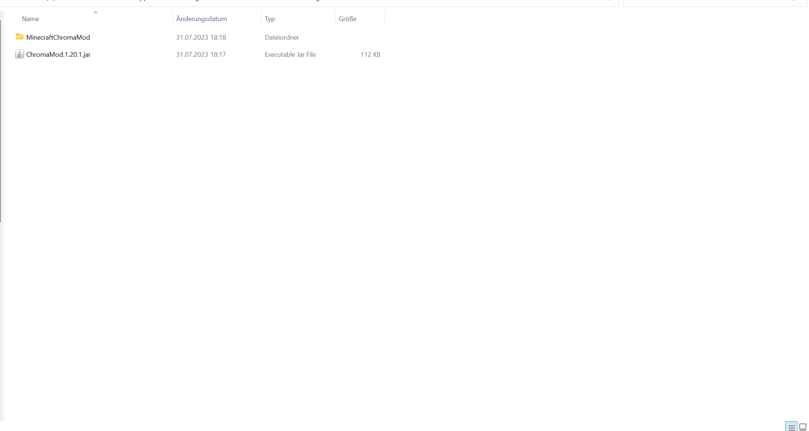

# ChromaMod (Forge 47.1.0 MInecraft: 1.20.1)
 ChromaMod for Minecraft to link your Gameplay with your Gaming Equipment

 
## Effects

-	Basic Effect
-	Menu Effect
-	Craft Item Effect
-	Player Damage Effect (does not work on Servers)
-	Fire Arrow Effect
-	Open Chest Effect
-	Attack Effect (does not work on Servers)
-	Potion Effect
-	Player In Water Effect
-	Player In Lava Effect
-	Item PickUp Effect

## Installation

1. Download Forge 1.20.1
2. Install it
3. Download the mod via the Releases tab (Download the .jar File and the Animations.zip File!)
4. Put the .jar File in the Minecraft-Mods Folder.
5. Unpack the MinecraftChromaMod.zip File and put the Ordner named "MinecraftChromaMod" in the Mod-Folder too.

Now Start your Game and enjoy the experience!
